# Architecture Diagrams: Test Data Management System

**Visual Guide to System Design**

---

## Table of Contents

1. [System Overview](#system-overview)
2. [DYNAMIC Mode Sequence](#dynamic-mode-sequence)
3. [SNAPSHOT Mode Sequence](#snapshot-mode-sequence)
4. [AUTO Mode Decision Flow](#auto-mode-decision-flow)
5. [Component Interaction](#component-interaction)
6. [Data Model](#data-model)
7. [Deployment Architecture](#deployment-architecture)

---

## System Overview

### High-Level System Context

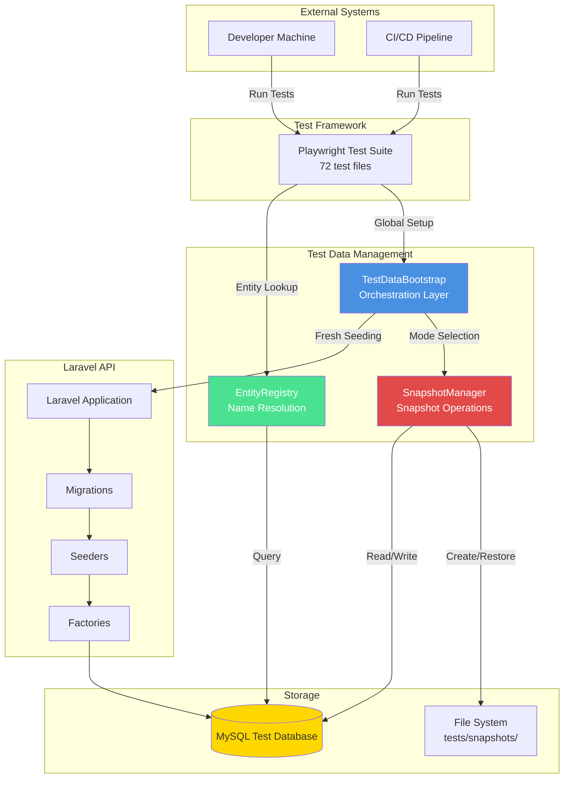

**Explanation**:
- **External Systems**: Developers and CI/CD trigger test execution
- **Test Framework**: Playwright orchestrates test runs across 72 test files
- **Test Data Management**: Three core components handle data provisioning
- **Laravel API**: Standard Laravel seeding infrastructure
- **Storage**: MySQL database and local file system for snapshots

**Key Components**:
- **TestDataBootstrap**: Entry point, orchestrates bootstrap and teardown
- **SnapshotManager**: Handles snapshot lifecycle and validation
- **EntityRegistry**: Provides name-to-UUID resolution for tests

**Design Decisions**:
- **Separation of concerns**: Each component has single responsibility
- **No test changes**: Tests interact only with EntityRegistry, unchanged bootstrap
- **Flexible modes**: Environment variables control behavior
- **Graceful degradation**: Automatic fallback to dynamic mode on errors

---

## DYNAMIC Mode Sequence

### Fresh Data Creation Flow

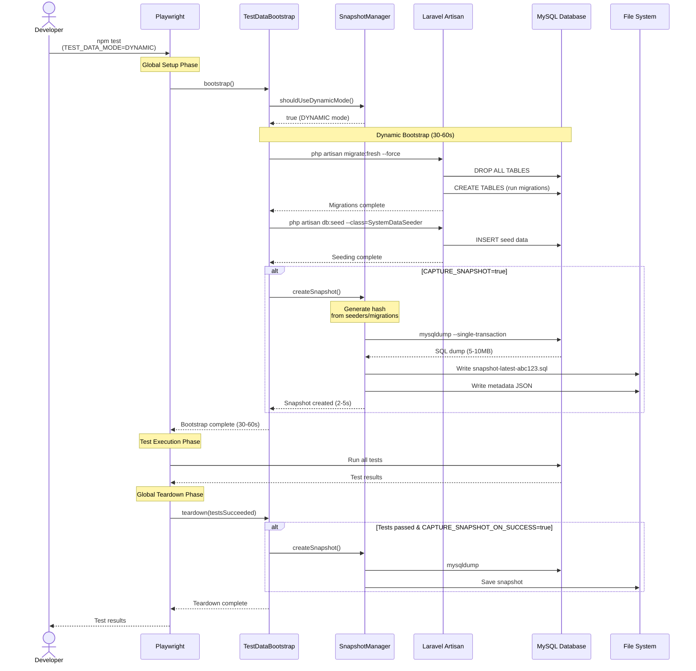

**Explanation**:

1. **Initialization**: Developer triggers test run with DYNAMIC mode
2. **Mode Selection**: SnapshotManager confirms dynamic mode
3. **Database Reset**: Laravel runs `migrate:fresh` to drop and recreate all tables
4. **Seeding**: SystemDataSeeder populates database with test data
5. **Optional Snapshot**: If configured, captures snapshot immediately after seeding
6. **Test Execution**: Tests run against freshly seeded database
7. **Teardown Snapshot**: If tests pass, optionally captures proven-good snapshot

**Performance Characteristics**:
- **Total Duration**: 30-60 seconds
- **Migrate Fresh**: 3-5 seconds
- **Seeding**: 25-55 seconds (varies by data volume)
- **Snapshot Capture**: 2-5 seconds (if enabled)

**Use Cases**:
- First-time setup (no snapshot exists)
- Debugging data-related issues
- After seeder/migration changes (auto-triggered by AUTO mode)
- Capturing proven-good snapshots for team

---

## SNAPSHOT Mode Sequence

### Fast Snapshot Restoration Flow

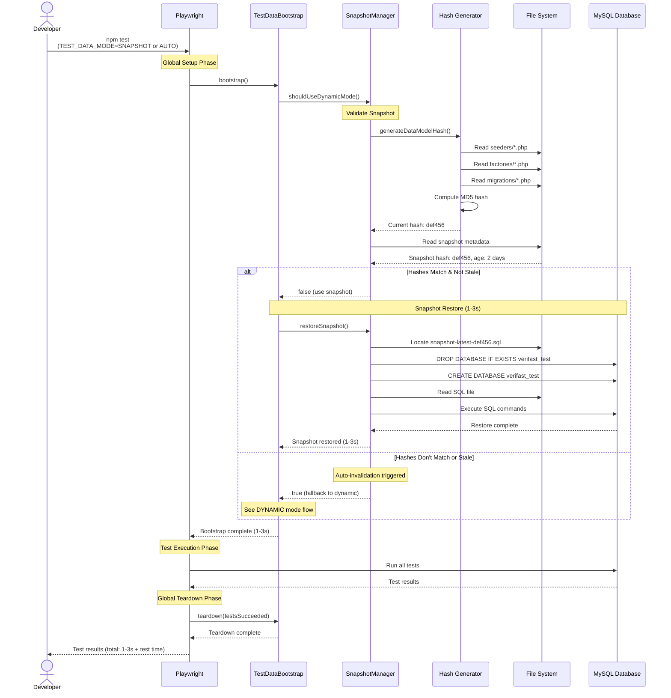

**Explanation**:

1. **Hash Generation**: Compute current hash from seeders, factories, migrations
2. **Snapshot Validation**: Compare current hash with snapshot metadata hash
3. **Age Check**: Ensure snapshot is not older than configured max age
4. **Database Reset**: Drop and recreate database (fast, no data)
5. **Snapshot Restore**: Execute SQL commands from snapshot file
6. **Test Execution**: Tests run against restored database state

**Performance Characteristics**:
- **Total Duration**: 1-3 seconds
- **Hash Generation**: 0.1-1 second (~100-200 PHP files)
- **Database Drop/Create**: 0.1-0.5 seconds
- **SQL Restore**: 0.5-2 seconds (5-10MB SQL file)

**Hash-Based Invalidation**:
- **What triggers invalidation**: Any change to seeders, factories, or migrations
- **How it's detected**: MD5 hash of all PHP file contents
- **What happens**: Automatic fallback to DYNAMIC mode
- **Collision probability**: 1 in 10^36 (negligible)

**Use Cases**:
- Local development iterations (rapid feedback)
- CI/CD pipelines (fast, consistent)
- Debugging specific test failures (reproducible state)
- Team collaboration (shared known-good state)

---

## AUTO Mode Decision Flow

### Intelligent Mode Selection

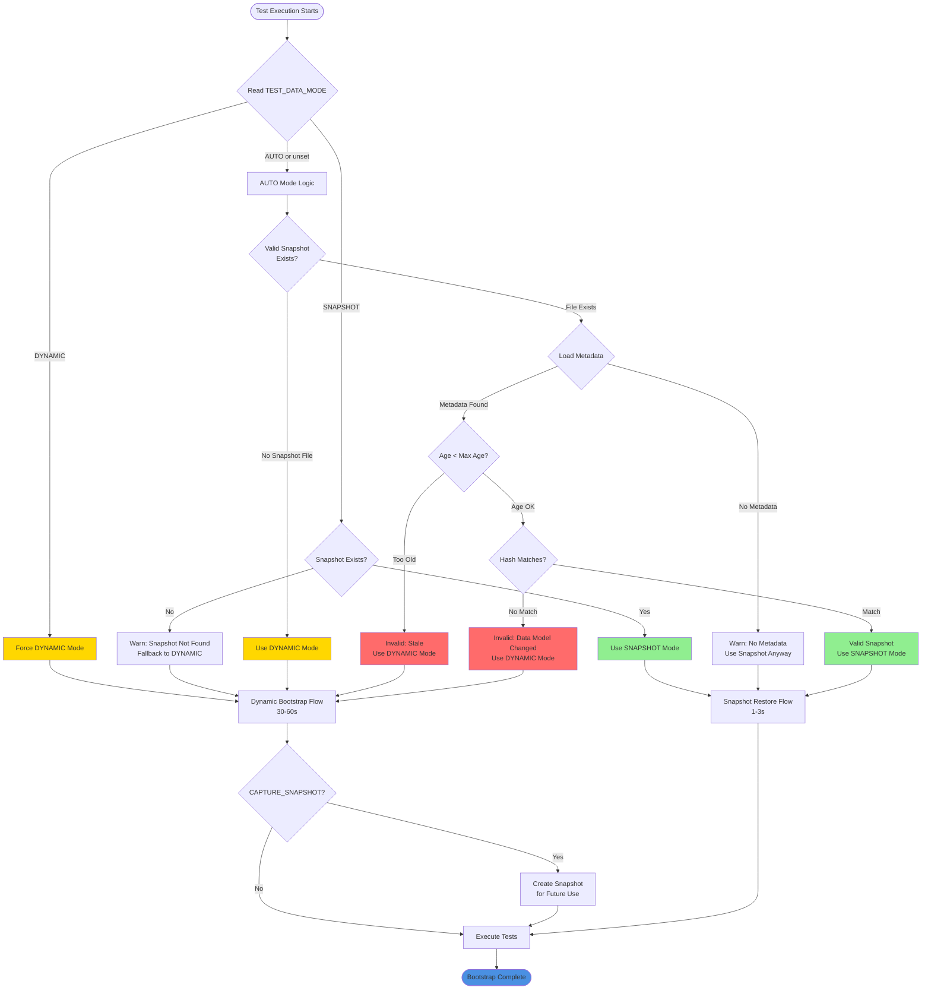

**Explanation**:

**Mode Selection Logic**:

1. **DYNAMIC Mode**:
   - Always runs fresh migrations and seeders
   - Bypasses snapshot entirely
   - Use case: Debugging, ensuring absolute freshness

2. **SNAPSHOT Mode**:
   - Requires valid snapshot to exist
   - Fails if snapshot not available (with fallback)
   - Use case: Fast local iterations, CI/CD

3. **AUTO Mode** (Recommended Default):
   - Intelligent decision based on snapshot validity
   - Checks snapshot existence, age, and hash
   - Automatic fallback to dynamic mode
   - Use case: Best balance of speed and reliability

**Validation Checks**:

1. **File Existence**: Does snapshot file exist on disk?
2. **Metadata Present**: Is accompanying `.meta.json` file present?
3. **Age Check**: Is snapshot younger than `SNAPSHOT_MAX_AGE` (default: 7 days)?
4. **Hash Match**: Does snapshot hash match current data model hash?

**Fallback Strategy**:
- Any validation failure → Automatic fallback to DYNAMIC mode
- Logs clear message explaining why fallback occurred
- No test failures due to snapshot issues
- Ensures tests always run successfully

**Design Rationale**:
- **Safety First**: Tests never fail due to missing snapshot
- **Performance Opportunistic**: Use snapshot when safe, not when risky
- **Transparent**: Clear logging of decision process
- **Zero Configuration**: Works out of the box with sensible defaults

---

## Component Interaction

### Component Relationships and Dependencies

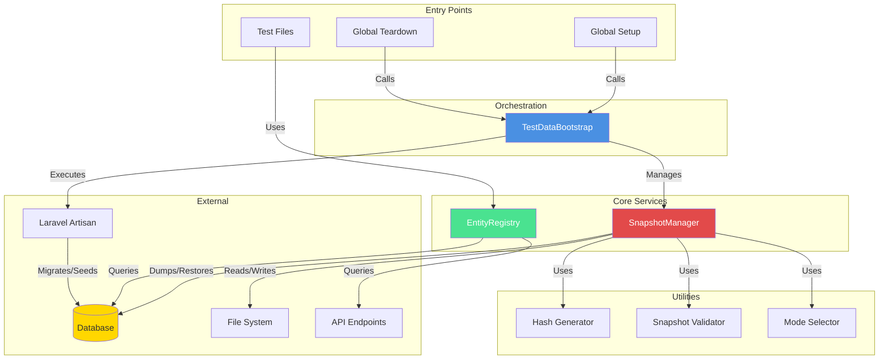

**Component Descriptions**:

### TestDataBootstrap (Orchestration Layer)
**Responsibility**: Coordinate test data setup and teardown
**Dependencies**: SnapshotManager, Laravel Artisan
**Used By**: Playwright Global Setup/Teardown
**Key Methods**:
- `bootstrap()` - Main entry point
- `bootstrapDynamic()` - Fresh seeding
- `bootstrapFromSnapshot()` - Restore snapshot
- `teardown()` - Cleanup and optional snapshot capture

### SnapshotManager (Core Service)
**Responsibility**: Snapshot lifecycle management
**Dependencies**: File System, MySQL CLI tools
**Used By**: TestDataBootstrap
**Key Methods**:
- `createSnapshot()` - Create database dump
- `restoreSnapshot()` - Restore from dump
- `generateDataModelHash()` - Compute validation hash
- `snapshotExists()` - Validate snapshot
- `shouldUseDynamicMode()` - Mode decision

### EntityRegistry (Lookup Service)
**Responsibility**: Name-to-UUID resolution
**Dependencies**: API endpoints, Database
**Used By**: Test files
**Key Methods**:
- `initialize()` - Load all entities
- `get()` - Find entity by name
- `getId()` - Get UUID by name
- Helper methods per entity type

**Interaction Patterns**:

1. **Bootstrap Phase**:
   - Global Setup → TestDataBootstrap → SnapshotManager → Database/Files

2. **Test Execution Phase**:
   - Tests → EntityRegistry → API/Database

3. **Teardown Phase**:
   - Global Teardown → TestDataBootstrap → SnapshotManager → Files

**Dependencies Summary**:

| Component | Depends On | Depended By |
|-----------|------------|-------------|
| TestDataBootstrap | SnapshotManager, Artisan | Global Setup/Teardown |
| SnapshotManager | File System, MySQL | TestDataBootstrap |
| EntityRegistry | API, Database | Test Files |
| Hash Generator | File System | SnapshotManager |
| Snapshot Validator | Metadata | SnapshotManager |

---

## Data Model

### Database Snapshot Structure

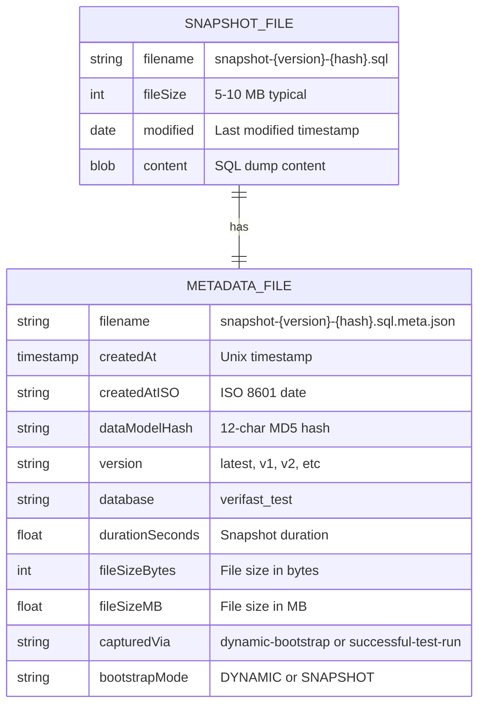

**Snapshot File Format**:

```sql
-- snapshot-latest-a1b2c3d4e5f6.sql

-- MySQL dump 8.0.32
-- Host: localhost    Database: verifast_test
-- ------------------------------------------------------

/*!40101 SET @OLD_CHARACTER_SET_CLIENT=@@CHARACTER_SET_CLIENT */;
-- ... MySQL dump header ...

DROP TABLE IF EXISTS `organizations`;
CREATE TABLE `organizations` (
  `id` char(36) NOT NULL,
  `name` varchar(255) NOT NULL,
  -- ... columns ...
  PRIMARY KEY (`id`)
) ENGINE=InnoDB DEFAULT CHARSET=utf8mb4;

INSERT INTO `organizations` VALUES
('uuid-1','ACME Corp','acme-corp', ...),
('uuid-2','Beta Inc','beta-inc', ...);

-- ... more tables and data ...
```

**Metadata File Format**:

```json
{
  "createdAt": 1738000000000,
  "createdAtISO": "2026-01-22T12:00:00.000Z",
  "dataModelHash": "a1b2c3d4e5f6",
  "version": "latest",
  "database": "verifast_test",
  "durationSeconds": 2.45,
  "fileSizeBytes": 5242880,
  "fileSizeMB": 5.00,
  "capturedVia": "successful-test-run",
  "bootstrapMode": "DYNAMIC"
}
```

### Entity Registry Cache Structure

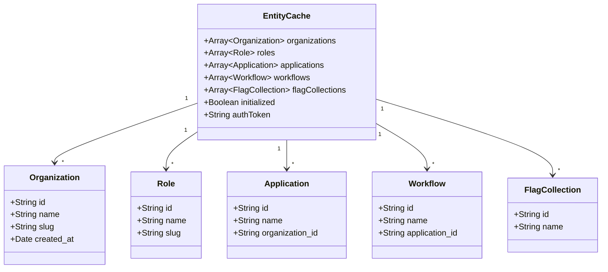

**Entity Cache Example**:

```javascript
{
  organizations: [
    { id: 'uuid-1', name: 'ACME Corp', slug: 'acme-corp', ... },
    { id: 'uuid-2', name: 'Beta Inc', slug: 'beta-inc', ... },
  ],
  roles: [
    { id: 'uuid-10', name: 'Applicant', slug: 'applicant', ... },
    { id: 'uuid-11', name: 'Reviewer', slug: 'reviewer', ... },
  ],
  applications: [
    { id: 'uuid-20', name: 'Demo App', organization_id: 'uuid-1', ... },
  ],
  workflows: [
    { id: 'uuid-30', name: 'Standard Flow', application_id: 'uuid-20', ... },
  ],
  flagCollections: [
    { id: 'uuid-40', name: 'Default Flags', ... },
  ],
  initialized: true,
  authToken: 'Bearer eyJ0eXAiOiJKV1Q...'
}
```

---

## Deployment Architecture

### Development Environment

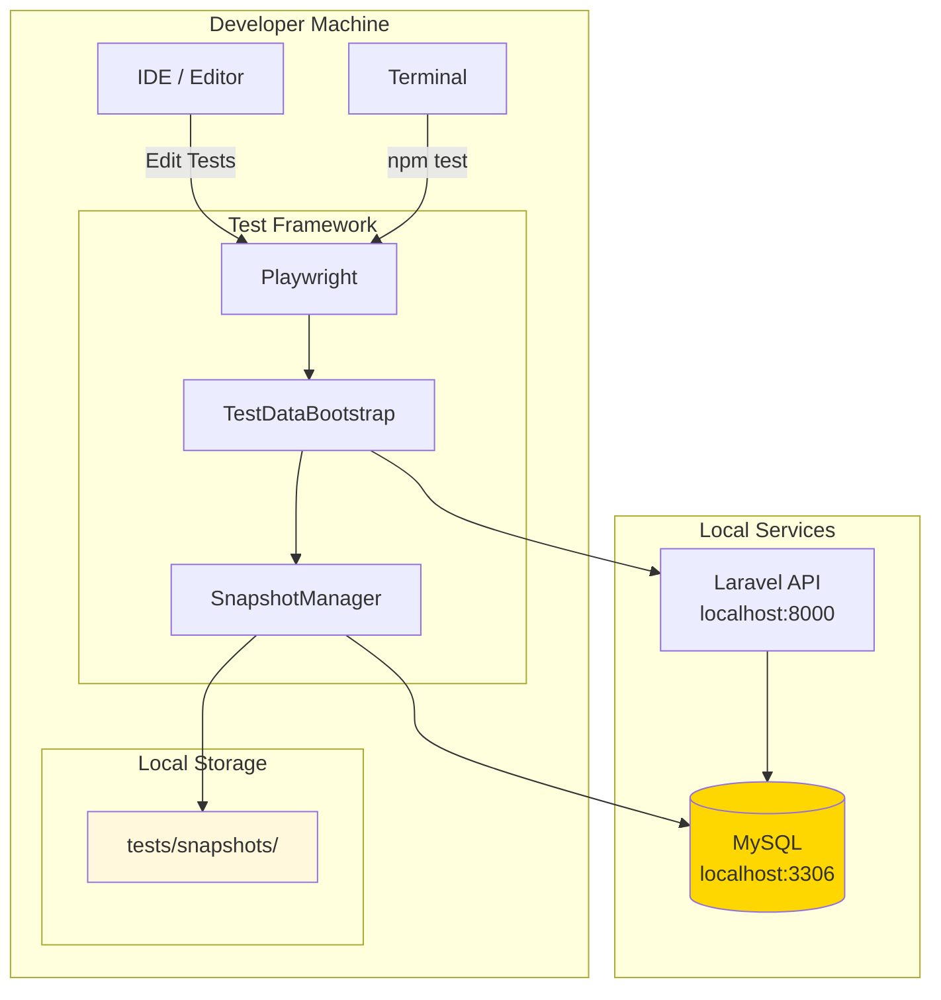

**Development Setup**:
- All components run locally
- Snapshots stored in project directory
- Fast iteration with snapshot mode
- No external dependencies

### CI/CD Pipeline

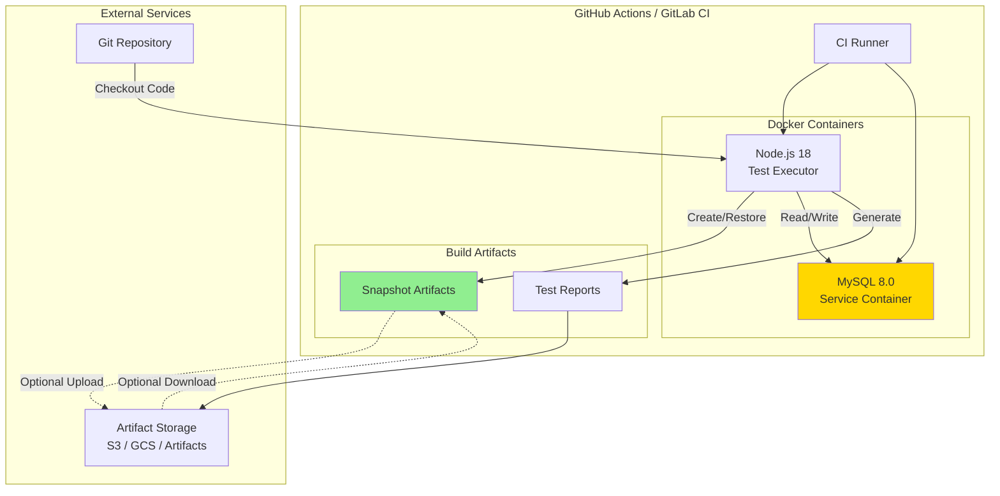

**CI/CD Configuration**:

```yaml
# .github/workflows/test.yml
name: Test Suite

on: [push, pull_request]

jobs:
  test:
    runs-on: ubuntu-latest

    services:
      mysql:
        image: mysql:8.0
        env:
          MYSQL_ROOT_PASSWORD: root
          MYSQL_DATABASE: verifast_test
        ports:
          - 3306:3306
        options: >-
          --health-cmd="mysqladmin ping"
          --health-interval=10s
          --health-timeout=5s
          --health-retries=3

    steps:
      - uses: actions/checkout@v3

      - name: Setup Node.js
        uses: actions/setup-node@v3
        with:
          node-version: 18
          cache: 'npm'

      - name: Install Dependencies
        run: npm ci

      - name: Download Cached Snapshot (if available)
        uses: actions/cache@v3
        with:
          path: tests/snapshots
          key: snapshot-${{ hashFiles('api/database/**/*.php') }}
          restore-keys: snapshot-

      - name: Run Tests
        env:
          TEST_DATA_MODE: AUTO
          CAPTURE_SNAPSHOT_ON_SUCCESS: true
          DB_HOST: 127.0.0.1
          DB_PORT: 3306
          DB_DATABASE: verifast_test
          DB_USERNAME: root
          DB_PASSWORD: root
        run: npm test

      - name: Upload Test Results
        if: always()
        uses: actions/upload-artifact@v3
        with:
          name: test-results
          path: playwright-report/

      - name: Upload Snapshot (on success)
        if: success()
        uses: actions/upload-artifact@v3
        with:
          name: test-snapshot
          path: tests/snapshots/
```

**CI/CD Optimizations**:

1. **Snapshot Caching**: Cache snapshots based on hash of database files
2. **Service Containers**: MySQL runs as service container
3. **Parallel Jobs**: Multiple test jobs share cached snapshot
4. **Artifact Storage**: Upload snapshots for future runs
5. **Health Checks**: Ensure MySQL ready before tests

### Production-Like Environment

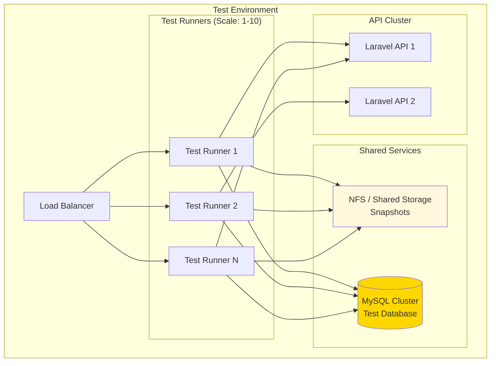

**Production-Like Considerations**:

1. **Shared Snapshots**: NFS or object storage for snapshot sharing
2. **Database Isolation**: Separate test database per runner (parallel execution)
3. **API Load Balancing**: Distribute API calls across instances
4. **Concurrency**: Multiple runners use unique snapshot directories
5. **Monitoring**: Centralized logging and metrics

---

## Performance Comparison

### Bootstrap Time Comparison

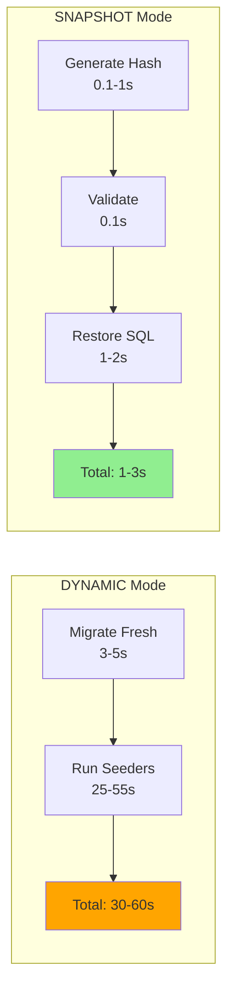

**Speedup**: 10-20x faster (30-60s → 1-3s)

---

## Related Documentation

- [Architecture Decision Record](./001-adr-test-data-management.md)
- [Technical Design](./technical-design.md)
- [Quick Start Guide](./quick-start-guide.md)
- [Operations Runbook](./runbook.md)
- [Implementation Checklist](./implementation-checklist.md)

---

**Last Updated**: 2026-01-22
**Maintained By**: QA Automation Team
