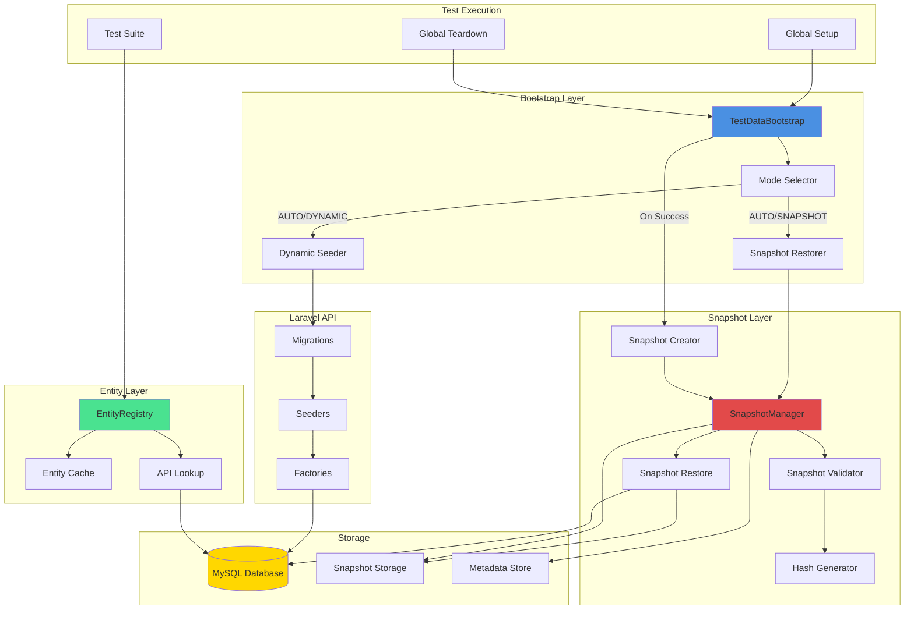
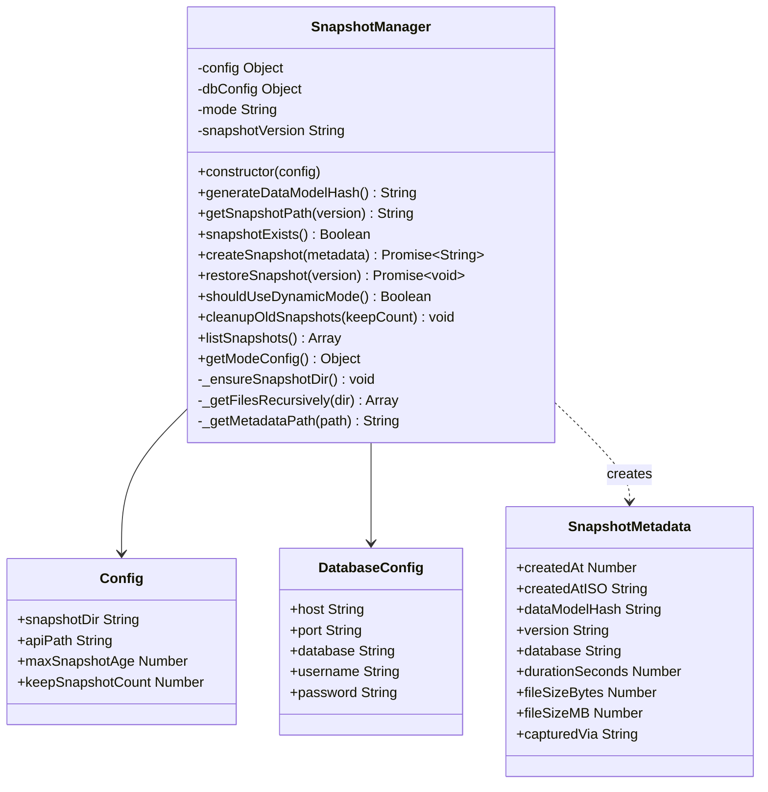
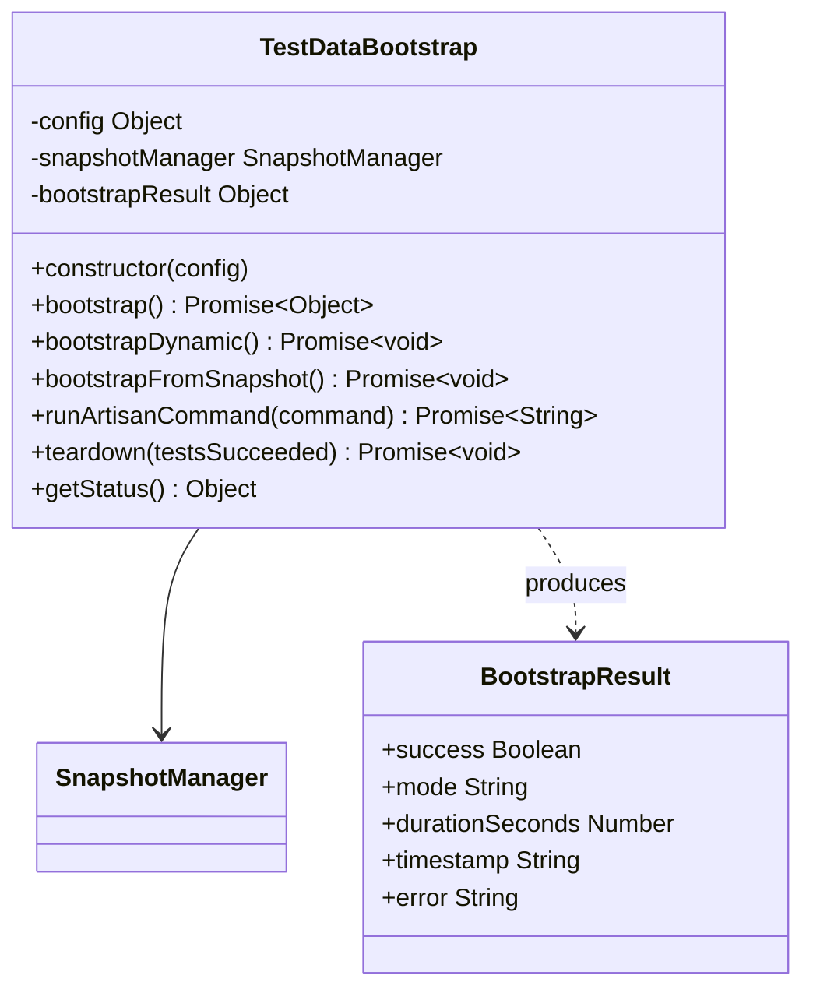
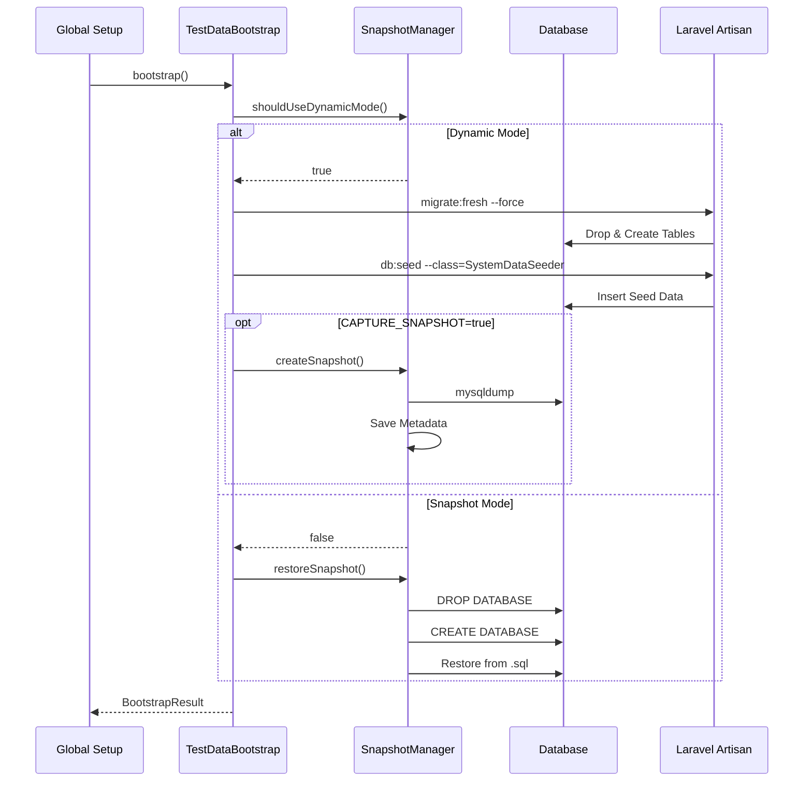
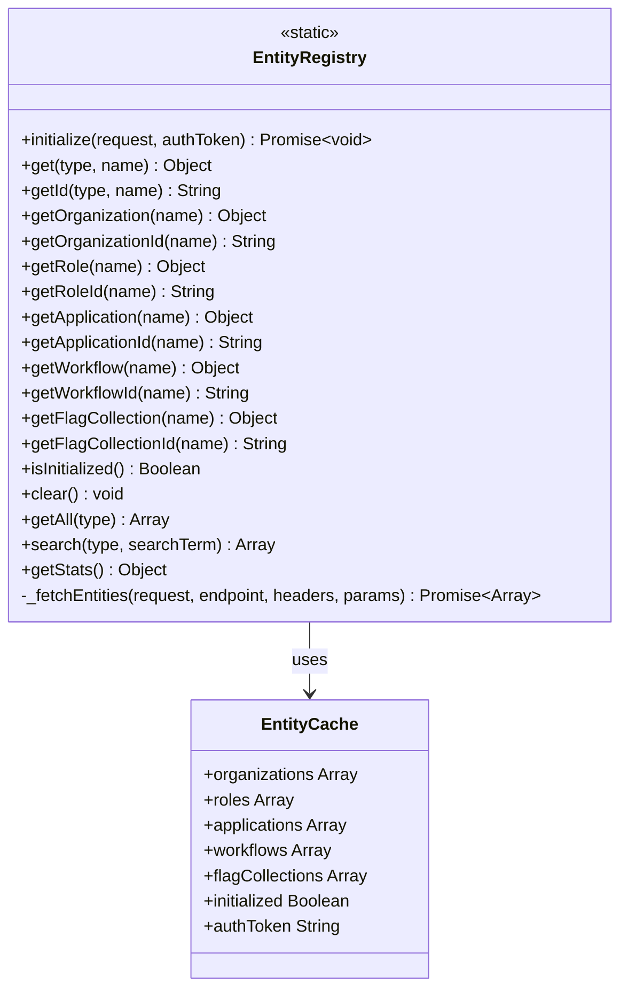
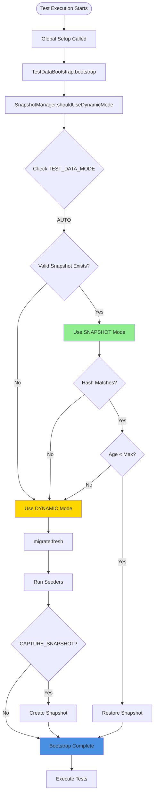
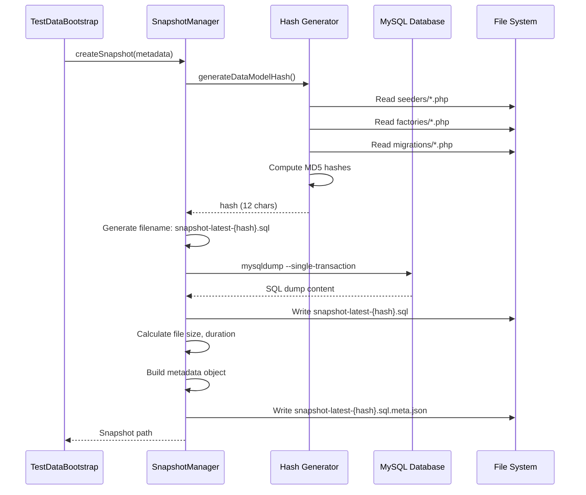
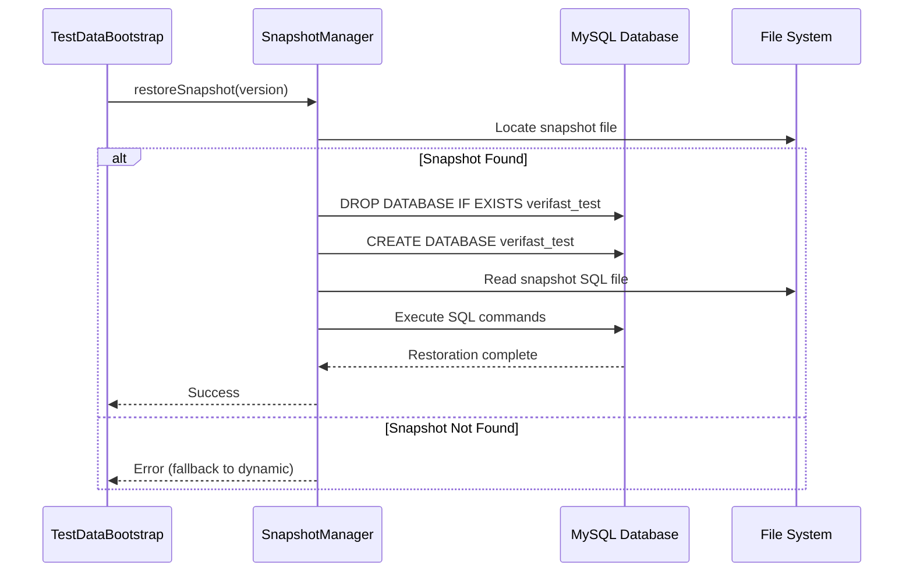
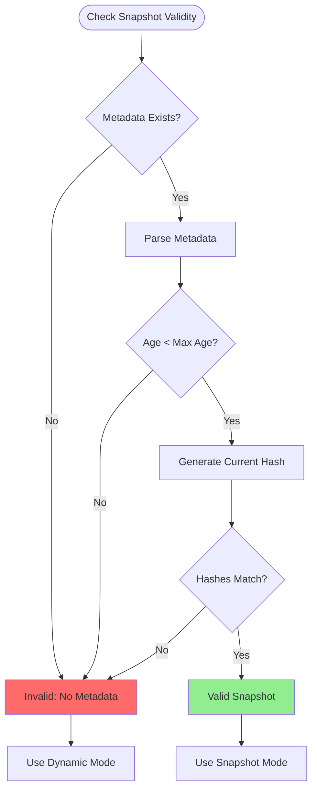
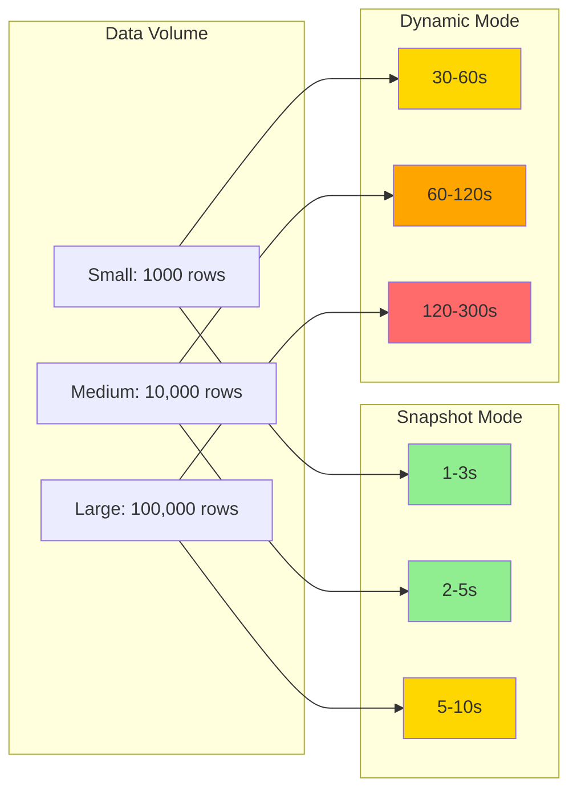

# Technical Design: Test Data Management System

**Version**: 1.0
**Date**: 2026-01-22
**Status**: Implementation Ready

---

## Table of Contents

1. [System Overview](#system-overview)
2. [Component Architecture](#component-architecture)
3. [Configuration Reference](#configuration-reference)
4. [Data Flow](#data-flow)
5. [Error Handling Strategy](#error-handling-strategy)
6. [Performance Characteristics](#performance-characteristics)
7. [Security Considerations](#security-considerations)

---

## System Overview

The Test Data Management System provides a hybrid approach to test data provisioning, combining the speed of database snapshots with the reliability of dynamic seeding. The system operates in three modes controlled by feature flags, with automatic invalidation based on data model changes.

### High-Level Architecture



### Component Responsibilities

| Component | Responsibility | Lines of Code |
|-----------|---------------|---------------|
| **SnapshotManager** | Snapshot creation, restoration, validation, hash generation | ~466 |
| **TestDataBootstrap** | Orchestrates bootstrap process, mode selection, teardown | ~269 |
| **EntityRegistry** | Name-to-UUID resolution, entity caching | ~334 |
| **Total** | | **~1,069** |

---

## Component Architecture

### SnapshotManager Class

**Location**: `/tests/helpers/snapshot-manager.js`
**Purpose**: Manages database snapshot lifecycle, validation, and hash-based invalidation



#### Key Methods

##### generateDataModelHash()
```javascript
/**
 * Generate MD5 hash of all seeders, factories, and migrations
 * @returns {string} 12-character hash
 */
generateDataModelHash() {
    // 1. Scan directories: database/seeders, factories, migrations
    // 2. Read all .php files
    // 3. Compute MD5 hash per file
    // 4. Sort and combine hashes
    // 5. Return first 12 characters
}
```

**Performance**: O(n) where n = number of PHP files (~100-200 files, <1s)

##### createSnapshot(metadata)
```javascript
/**
 * Create database snapshot using mysqldump
 * @param {Object} metadata - Additional metadata
 * @returns {Promise<string>} Path to created snapshot
 */
async createSnapshot(metadata = {}) {
    // 1. Generate snapshot path with hash
    // 2. Execute mysqldump command
    // 3. Calculate file size and duration
    // 4. Write metadata JSON file
    // 5. Return snapshot path
}
```

**Performance**: ~2-5 seconds for typical database (~5-10MB dump)

##### restoreSnapshot(version)
```javascript
/**
 * Restore database from snapshot
 * @param {string|null} version - Optional version override
 * @returns {Promise<void>}
 */
async restoreSnapshot(version = null) {
    // 1. Locate snapshot file
    // 2. Drop existing database
    // 3. Create fresh database
    // 4. Restore from SQL dump
    // 5. Verify restoration
}
```

**Performance**: ~1-3 seconds for typical database

##### shouldUseDynamicMode()
```javascript
/**
 * Determine mode based on TEST_DATA_MODE and snapshot availability
 * @returns {boolean} True if should use dynamic mode
 */
shouldUseDynamicMode() {
    // Mode Logic:
    // DYNAMIC → Always true
    // SNAPSHOT → False if snapshot exists, else true (fallback)
    // AUTO → False if valid snapshot exists, else true
}
```

---

### TestDataBootstrap Class

**Location**: `/tests/helpers/test-data-bootstrap.js`
**Purpose**: Orchestrates test data setup and teardown



#### Bootstrap Flow



#### Key Methods

##### bootstrap()
```javascript
/**
 * Main bootstrap entry point
 * @returns {Promise<Object>} Bootstrap result with timing
 */
async bootstrap() {
    // 1. Determine mode (dynamic vs snapshot)
    // 2. Execute appropriate bootstrap
    // 3. Track duration and status
    // 4. Return result object
}
```

##### bootstrapDynamic()
```javascript
/**
 * Dynamic mode: Fresh migrations and seeders
 * @returns {Promise<void>}
 */
async bootstrapDynamic() {
    // 1. Run migrate:fresh
    // 2. Run all configured seeders
    // 3. Optionally capture snapshot
}
```

##### teardown(testsSucceeded)
```javascript
/**
 * Teardown after test execution
 * @param {boolean} testsSucceeded - Whether tests passed
 * @returns {Promise<void>}
 */
async teardown(testsSucceeded) {
    // 1. If tests passed and CAPTURE_SNAPSHOT_ON_SUCCESS=true
    // 2. Create snapshot from final state
    // 3. Cleanup old snapshots
}
```

---

### EntityRegistry Class

**Location**: `/tests/helpers/entity-registry.js`
**Purpose**: Provides name-to-UUID resolution for test entities



#### Usage Example

```javascript
// In test setup
import { EntityRegistry } from '~/tests/helpers/entity-registry';

// Initialize once per test suite
await EntityRegistry.initialize(request, authToken);

// Use in tests
const orgId = EntityRegistry.getOrganizationId('ACME Corp');
const roleId = EntityRegistry.getRoleId('Applicant');
const appId = EntityRegistry.getApplicationId('Test Application');

// Get full entity
const org = EntityRegistry.getOrganization('ACME Corp');
console.log(org.id, org.name, org.slug);
```

#### Key Methods

##### initialize(request, authToken)
```javascript
/**
 * Initialize registry by fetching all entities
 * @param {Object} request - Playwright API request context
 * @param {string} authToken - Bearer token
 * @returns {Promise<void>}
 */
static async initialize(request, authToken) {
    // 1. Check if already initialized
    // 2. Fetch all entity types in parallel
    // 3. Cache results
    // 4. Mark as initialized
}
```

**Performance**: ~0.5-2 seconds (parallel API calls)

##### get(type, name)
```javascript
/**
 * Get entity by type and name
 * @param {string} type - Entity type
 * @param {string} name - Entity name
 * @returns {Object} Entity object
 * @throws {Error} If not found
 */
static get(type, name) {
    // 1. Validate registry initialized
    // 2. Map type to cache key
    // 3. Search cache by name (case-insensitive)
    // 4. Return entity or throw error with suggestions
}
```

**Performance**: O(n) linear search, typically <10ms for <1000 entities

---

## Configuration Reference

### Environment Variables

#### Mode Selection

```bash
# TEST_DATA_MODE
# Controls which bootstrap strategy to use
# Values: AUTO | DYNAMIC | SNAPSHOT
# Default: AUTO
TEST_DATA_MODE=AUTO

# SNAPSHOT_VERSION
# Snapshot version identifier
# Values: latest | v1 | v2 | custom-name
# Default: latest
SNAPSHOT_VERSION=latest
```

#### Snapshot Control

```bash
# CAPTURE_SNAPSHOT
# Capture snapshot immediately after dynamic seeding
# Values: true | false
# Default: false
CAPTURE_SNAPSHOT=false

# CAPTURE_SNAPSHOT_ON_SUCCESS
# Capture snapshot after successful test run in teardown
# Values: true | false
# Default: false
CAPTURE_SNAPSHOT_ON_SUCCESS=false

# RUN_PENDING_MIGRATIONS
# Run pending migrations after snapshot restore
# Values: true | false
# Default: false
RUN_PENDING_MIGRATIONS=false
```

#### Configuration

```bash
# SNAPSHOT_MAX_AGE
# Maximum age before snapshot considered stale
# Format: Integer (milliseconds) or shorthand (7d, 12h)
# Default: 604800000 (7 days)
SNAPSHOT_MAX_AGE=604800000

# SNAPSHOT_KEEP_COUNT
# Number of old snapshots to retain
# Values: Integer >= 1
# Default: 3
SNAPSHOT_KEEP_COUNT=3
```

#### Database Configuration

```bash
# Standard Laravel database configuration
DB_HOST=127.0.0.1
DB_PORT=3306
DB_DATABASE=verifast_test
DB_USERNAME=root
DB_PASSWORD=
```

### Configuration Object

```javascript
// Default configuration in SnapshotManager
const DEFAULT_CONFIG = {
    snapshotDir: '/path/to/tests/snapshots',
    apiPath: '/path/to/laravel/api',
    maxSnapshotAge: 7 * 24 * 60 * 60 * 1000, // 7 days
    keepSnapshotCount: 3,
};

// Default configuration in TestDataBootstrap
const DEFAULT_CONFIG = {
    apiPath: '/path/to/laravel/api',
    seeders: [
        'SystemDataSeeder',
    ],
    timeout: 120000, // 2 minutes
};
```

### Playwright Configuration Integration

```javascript
// playwright.config.js
import { defineConfig } from '@playwright/test';
import { globalSetup, globalTeardown } from './tests/helpers/test-data-bootstrap.js';

export default defineConfig({
    globalSetup: './tests/helpers/test-data-bootstrap.js#globalSetup',
    globalTeardown: './tests/helpers/test-data-bootstrap.js#globalTeardown',
    // ... other config
});
```

---

## Data Flow

### Startup Flow (AUTO Mode)



### Snapshot Creation Flow



### Snapshot Restoration Flow



### Hash Invalidation Flow



---

## Error Handling Strategy

### Error Categories

| Category | Severity | Handling | Fallback |
|----------|----------|----------|----------|
| **Snapshot Not Found** | Medium | Log warning, use dynamic | Always succeeds |
| **Snapshot Corrupted** | Medium | Log error, use dynamic | Always succeeds |
| **Hash Generation Failed** | Low | Log warning, use 'no-hash' | Continues |
| **Mysqldump Failed** | High | Log error, throw | Test execution fails |
| **MySQL Restore Failed** | High | Log error, fallback dynamic | Succeeds via dynamic |
| **Seeder Failed** | Critical | Log error, throw | Test execution fails |
| **Entity Registry Init Failed** | Medium | Log error, tests can continue | Tests use fallback IDs |

### Error Handling Patterns

#### Graceful Degradation
```javascript
// Example: Snapshot restore with fallback
async bootstrapFromSnapshot() {
    try {
        await this.snapshotManager.restoreSnapshot();
    } catch (error) {
        console.error('Snapshot restore failed:', error.message);
        console.log('Falling back to dynamic mode...');
        await this.bootstrapDynamic(); // Graceful fallback
    }
}
```

#### Fail-Fast
```javascript
// Example: Critical seeder failure
async bootstrapDynamic() {
    try {
        await this.runArtisanCommand('migrate:fresh --force');
        await this.runArtisanCommand('db:seed --class=SystemDataSeeder --force');
    } catch (error) {
        console.error('Dynamic bootstrap failed:', error.message);
        throw error; // Fail fast - cannot proceed without data
    }
}
```

#### Warning and Continue
```javascript
// Example: Hash generation failure
generateDataModelHash() {
    try {
        // ... hash generation logic
    } catch (error) {
        console.warn('Hash generation failed:', error.message);
        return 'no-hash'; // Use fallback, continue
    }
}
```

### Logging Strategy

```javascript
// Console logging with visual indicators
console.log('✅ Success message');
console.log('⚠️  Warning message');
console.error('❌ Error message');
console.log('📸 Snapshot operation');
console.log('🔧 Dynamic operation');
console.log('📋 Entity registry operation');
```

---

## Performance Characteristics

### Bootstrap Performance Comparison

| Mode | Cold Start | Warm Start | Operations |
|------|------------|------------|------------|
| **Dynamic** | 30-60s | 30-60s | Migrate + Seed |
| **Snapshot (valid)** | 1-3s | 1-3s | Restore SQL |
| **Snapshot (invalid)** | 32-63s | 32-63s | Hash + Fallback Dynamic |
| **AUTO (cached)** | 1-3s | 1-3s | Hash + Restore |
| **AUTO (uncached)** | 31-61s | 31-61s | Hash + Dynamic + Capture |

### Operation Timings

| Operation | Typical Duration | Notes |
|-----------|------------------|-------|
| Hash Generation | 0.1-1s | ~100-200 PHP files |
| Snapshot Creation | 2-5s | 5-10MB mysqldump |
| Snapshot Restoration | 1-3s | DROP + CREATE + Restore |
| Entity Registry Init | 0.5-2s | 5 parallel API calls |
| Seeder Execution | 25-55s | Varies by data volume |
| Migration Fresh | 3-5s | Drop + Migrate |

### Memory Usage

| Component | Memory Footprint | Notes |
|-----------|------------------|-------|
| SnapshotManager | ~1-2 MB | File I/O buffers |
| TestDataBootstrap | ~1 MB | Minimal state |
| EntityRegistry | ~500 KB - 2 MB | Cached entities (~1000 items) |
| Snapshot Files | 5-10 MB per snapshot | Disk storage |
| **Total Runtime** | **~3-5 MB** | Negligible overhead |

### Scalability Characteristics



**Conclusion**: Snapshot mode scales linearly with data size, dynamic mode scales exponentially.

---

## Security Considerations

### Database Credentials

**Risk**: Credentials exposed in environment variables or command-line arguments

**Mitigation**:
- Use environment variables (never hardcode)
- Avoid passing password via CLI arguments (MySQL reads from env)
- Restrict snapshot directory permissions (0700)
- Add `/tests/snapshots/` to `.gitignore`

```bash
# Secure permissions
chmod 700 /path/to/tests/snapshots
```

### Snapshot File Security

**Risk**: Snapshots contain sensitive production-like data

**Mitigation**:
- Snapshots stored outside version control
- Use test-specific data (no real user info)
- Encrypt snapshots if containing sensitive data
- Restrict access to snapshot directory

```javascript
// In .gitignore
tests/snapshots/*
!tests/snapshots/.gitkeep
```

### Command Injection

**Risk**: Unsanitized input in shell commands

**Mitigation**:
- All database config from environment variables (trusted source)
- No user input in shell commands
- Use `execSync` with explicit shell: true and quoted arguments

```javascript
// Safe: Quoted paths and env vars only
const cmd = `mysqldump --host=${this.dbConfig.host} --user=${this.dbConfig.username} > "${snapshotPath}"`;
```

### Access Control

**Risk**: Unauthorized access to snapshot management

**Mitigation**:
- Snapshot operations require database credentials
- CI/CD secrets managed securely
- No public snapshot endpoints

### Data Sanitization

**Risk**: Test data contains sensitive information

**Mitigation**:
- Use fake data generators in seeders
- Avoid production data in test environments
- Regular audit of seeded data

---

## Extension Points

### Custom Snapshot Strategies

```javascript
// Extend SnapshotManager for custom strategies
class CustomSnapshotManager extends SnapshotManager {
    // Override snapshot validation logic
    snapshotExists() {
        // Custom validation
        return super.snapshotExists() && this.customCheck();
    }
}
```

### Multiple Snapshot Variants

```javascript
// Use SNAPSHOT_VERSION for different data sets
TEST_DATA_MODE=SNAPSHOT SNAPSHOT_VERSION=minimal    # Minimal data
TEST_DATA_MODE=SNAPSHOT SNAPSHOT_VERSION=full       # Full data
TEST_DATA_MODE=SNAPSHOT SNAPSHOT_VERSION=edge-cases # Edge case data
```

### Custom Entity Types

```javascript
// Add custom entity types to EntityRegistry
EntityRegistry.initialize(request, authToken, {
    customEntities: [
        { type: 'products', endpoint: '/products' },
        { type: 'orders', endpoint: '/orders' },
    ]
});
```

---

## Related Documentation

- [Architecture Decision Record](./001-adr-test-data-management.md)
- [Quick Start Guide](./quick-start-guide.md)
- [Architecture Diagrams](./architecture-diagrams.md)
- [Operations Runbook](./runbook.md)
- [Implementation Checklist](./implementation-checklist.md)

---

## Appendix: File Structure

```
web-app-ui-test-framework/
├── tests/
│   ├── helpers/
│   │   ├── snapshot-manager.js          # 466 lines
│   │   ├── test-data-bootstrap.js       # 269 lines
│   │   └── entity-registry.js           # 334 lines
│   ├── snapshots/                       # Gitignored
│   │   ├── .gitkeep
│   │   ├── snapshot-latest-a1b2c3.sql
│   │   ├── snapshot-latest-a1b2c3.sql.meta.json
│   │   ├── snapshot-v1-d4e5f6.sql
│   │   └── snapshot-v1-d4e5f6.sql.meta.json
│   └── *.spec.js                        # Test files (72 files)
├── docs/
│   └── test-data-management/
│       ├── 001-adr-test-data-management.md
│       ├── technical-design.md          # This document
│       ├── quick-start-guide.md
│       ├── architecture-diagrams.md
│       ├── runbook.md
│       └── implementation-checklist.md
└── playwright.config.js                 # Playwright configuration
```

---

**Document Maintained By**: QA Automation Team
**Last Updated**: 2026-01-22
**Next Review**: 2026-04-22
